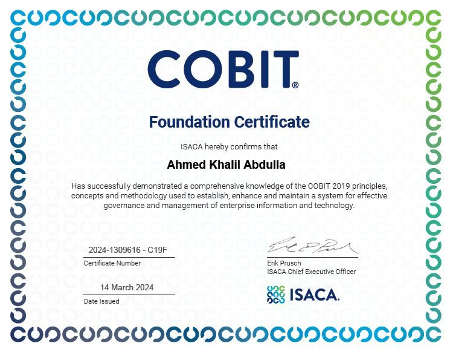

<h1 dir='rtl' align='right'>تجربتي مع اختبار COBIT 2019 Foundation</h1>

<!--
</img>
-->

<h2 dir='rtl' align='right'>مقدمة</h2>

في هذا المقال أخلص لكم تجربتي في التحضير لاختبار COBIT 2019 Foundation كما أذكر لكم المراجع التي قمت بالاعتماد عليها للاستعداد للاختبار.

<h2 dir='rtl' align='right'>ماهي شهادة COBIT 2019 Foundation ؟</h2>

في عالم تكنولوجيا المعلومات الذي يتسم بالتغير المستمر والتطور السريع، تعتبر شهادة COBIT 2019 Foundation أحد الركائز الأساسية للمهنيين الساعين إلى إثبات كفاءتهم في مجال إدارة وحوكمة تكنولوجيا المعلومات. هذه الشهادة، التي تقدمها ISACA، توفر إطار عمل شامل لتحسن الأداء، وإدارة المخاطر، وضمان الامتثال من خلال الممارسات المعترف بها عالميًا.

<h2 dir='rtl' align='right'>تفاصيل الشهادة:</h2>

هذه التفاصيل ستقوم بالإجابة على استفسارات العديد ممن يقرء هذا المقال حاليا:

<ul dir='rtl'>
  <li><b>عدد الأسئلة: </b>75</li>
  <li><b>مدة الاختبار: </b>120 دقيقة</li>
  <li><b>درجة النجاح: </b>65% وأعلى</li>
  <li><b>رسوم الاختبار: </b>175 دولار أمريكي</li>
</ul>

<h2 dir='rtl' align='right'>المراجع المستخدمة في التحضير للاختبار:</h2>

هذه المراجع التي استخدمتها خلال فترة التحضير:

<ul dir="rtl">
<li><a href="https://www.udemy.com/course/cobit-2019-foundation-official-accredited">كورس كامل للتحضير للشهادة (على منصة Udemy)</a>: قمت بالاعتماد على هذا الكورس بشكل أساسي للتحضير الاختبار. تكلفة شراء الكورس هي (14) دولار أمريكي تقريبا.</li>
<li><a href="https://www.udemy.com/course/cobit-2019-foundation-practice-exams">اختبارات تجريبية للاستعداد للاختبار (على منصة Udemy)</a>: هذه عبارة عن عدد 4 اختبارات تجريبية تحاكي الاختبار الفعلي. أنصح بإستخدامها قبل موعد الاختبار بعدة أيام للتأكد من أنك جاهز بنسبة كبيرة لاجتياز الاختبار بنجاح. كما قمت بشراء هذه الاختبارات التجريبية بمبلغ (19) دولار أمريكي تقريبا.</li>
<li><a href="https://store.isaca.org/s/store#/store/browse/detail/a2S4w000004Ko9cEAC">COBIT 2019 Framework: Introduction & Methodology</a>: يعتبر هذا هو أحد المطبوعات الرسمية من ISACA والمتعلقة بإطار COBIT 2019. كما أنه يشكل نسبة 80% من ما يغطيه الاختبار. يمكن تحميل هذا المستند مجانا من الموقع الرسمي لمنظمة ISACA.</li>
<li><a href="https://store.isaca.org/s/store#/store/browse/detail/a2S4w000004Ko9ZEAS">COBIT 2019 Framework: Governance & Management Objectives</a>: هذا المستند الرسمي الثاني من ISACA والذي يشرح فيه تفاصيل الأهداف الحوكمية والإدارية المتعلقة بإطار COBIT 2019 بشكل تفصيلي. كما يغطي هذا المستند نسة 20% من المحتوى المطلوب في الاختبار. يمكن تحميل هذا المستند مجانا من الموقع الرسمي لمنظمة ISACA.</li>
</ul>

<h2 dir='rtl' align='right'>تجربة التحضير للاختبار:</h2>

قمت بمساهدة جميع الفيديوهات الخاص بالكورس في Udemy خلال 3 أيام. وفي حال لم تكن المعلومات المذكورة في الكورس كافية، أو احتجت إلى تفاصيل إضافية، فأقوم بالرجوع إلى المستندات الرسمية من ISACA وقراءة الأقسام والصفحات المتعلقة بما لم يتم تغطيته في الكورس بشكل واضح أو شامل.

خصصت اليوم الرابع للقيام ببعض الاختبارات التجريبية ، والتي قمت بمشاركة رابطها لكم في قسم المراجع. أنهيت عدد 3 اختبارات من أصل 4، حيث أحسست بأني جاهز لخوض الاختبار الرسمي. خصوصا وأن الاختبار الرسمي كان مجدول لنفس هذا اليوم مساء (خلال فترة شهر رمضان).

<h3 dir='rtl' align='right'>تجربة الاختبار</h3>
<ul dir='rtl'>
  <li>الاختبار كان بطريقة الاختبار عن بعد (Proctored Exam)، بحيث يكون هناك مراقب عليك من خلال كاميرا الكمبيوتر.</li>
  <li>الأسئلة كانت نوعا ما أصعب من الأسئلة الموجودة في الاختبارات التجريبية بنسبة قليلة جدا</li>
  <li>اجتزت الاختبار بنسبة (89%).</li>
  <li>انتهيت الاختبار في غضون (50) دقيقة فقط، حيث لم أكن أراجع إجاباتي بعد الإجابة عليها في أول مرة.</li>
</ul>

<h2 dir='rtl' align='right'>صورة الشهادة</h2>
<td>

</td>

<h2 dir='rtl' align='right'>التواصل</h2>

يمكنك التواصل معي على تويتر: <a href="https://www.twitter.com/akhalil_qa">@akhalil_qa</a>

